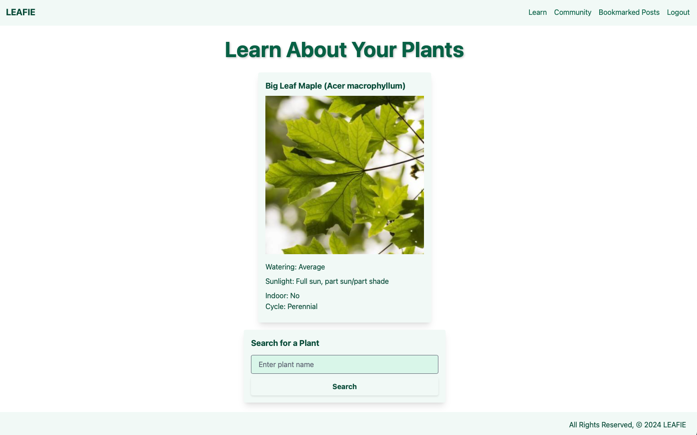

# LEAFIE

## Introduction
[Leafie](https://leafie-d35b317acff1.herokuapp.com) is a dynamic blog developed using Django, designed for plant enthusiasts who wish to engage with a community by sharing posts, comments, and tips about plant care. This website not only allows users to interact with each other's posts but also integrates an API to retrieve valuable information on plant care such as watering schedules, sunlight requirements, and more.

## Features
- **User Authentication**: Supports user registration, login, and logout functionalities.
- **Plant Care Information**: Fetch plant care data from an external API, providing details like watering frequency, required sunlight, and whether the plant is suitable for indoor settings.
- **Post Interaction**: Users can create, delete, like, and bookmark posts.
- **Comments**: Users can comment on posts and delete their own comments.
- **Bookmarking**: Users can bookmark posts for later reference.

## Technology Stack
- **Backend**: Django (Python)
- **Database**: PostgreSQL
- **Frontend**: HTML, CSS (with Django template language)
- **API Integration**: External plant care API to fetch plant-specific data and images.

## Screenshots

### Home Page

### Learn

### Community

### Details

## Planned Enhancements

### Interactive Plant Care Calendars

- **Receive timely notifications** about the care needs of each users' plant in their collection.
- **Customize care schedules** based on specific plant recommendations.
- **Track plant health** and growth milestones over time.

### User Profiles

- **Showcase their plant collection** with details such as plant species, acquisition dates, and custom notes.
- **Share their care routines** and tips with other community members.
- **Access a log of past activities** such as previous watering and fertilizing times, helping them refine their plant care practices.
